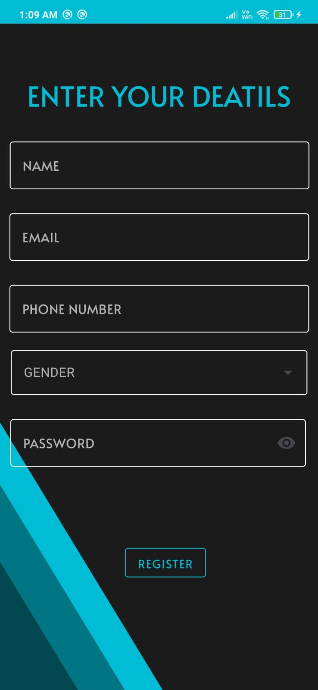

# Photo Drive App
Photo Drive App is an Android application developed in Kotlin that allows users to store and manage their photos securely. It uses Firebase for authentication, real-time database, and storage. Users can add images from the camera as well as from internal storage.

## Features
- Material UI: Modern and intuitive user interface using Material UI components.
- Firebase Authentication: Secure login and signup using Firebase Auth.
- Firebase Realtime Database: Store and manage image metadata.
- Firebase Storage: Save and retrieve images from Firebase Storage.
- Add Images: Capture images using the device camera or select images from internal storage.
- View Images: Browse and view stored images.
- Delete Images

## Screenshots

## Contributing

We welcome contributions to the Scanner App. If you'd like to contribute, please follow these guidelines:

1. Fork the repository.
2. Create a new branch for your feature or bug fix.
3. Make your changes and test thoroughly.
4. Submit a pull request with a clear description of your changes.

